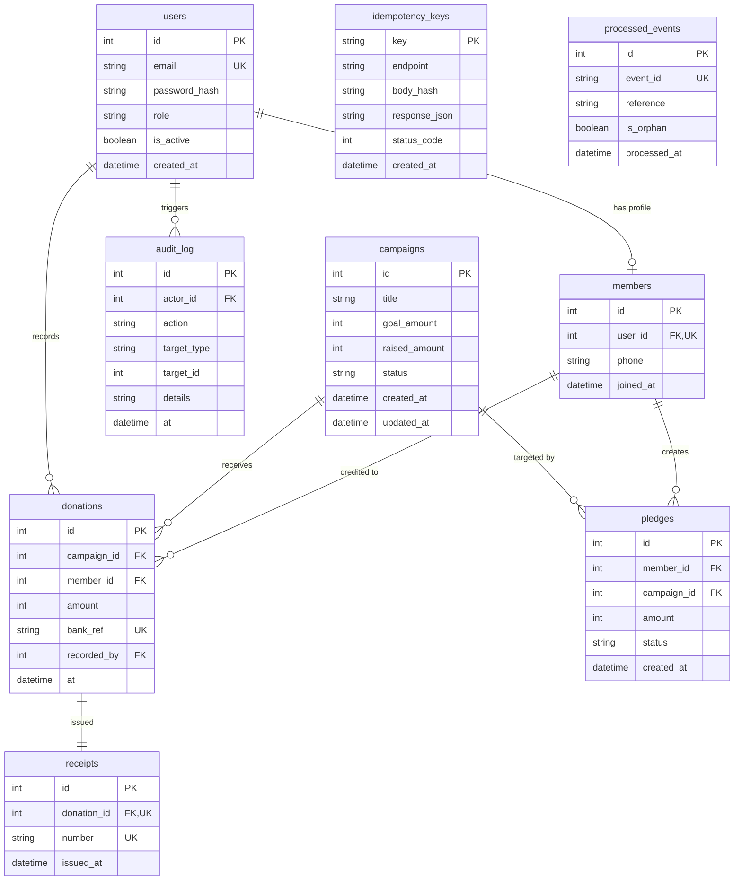
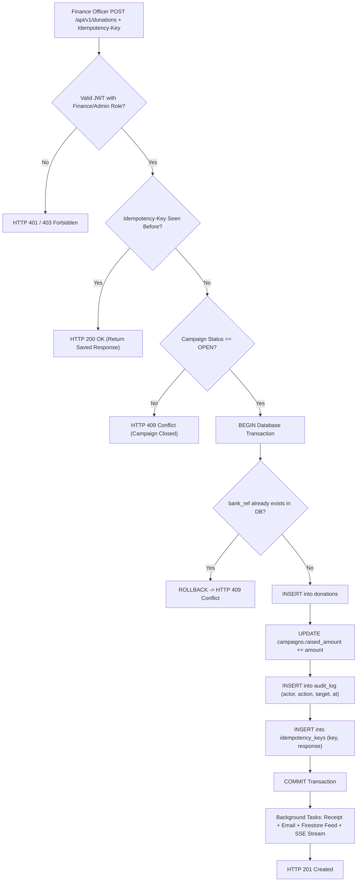

# GiveNaija — NGO Donations & Members Backend

> **Backend Capstone Project — Team Mighty Spark (Victor & Anthony)**  
> *"Record every Naira exactly once, with an audit trail nobody can edit."*

---

## 1. Executive Summary & Problem Overview

Non-Governmental Organizations (NGOs) and churches rely on donor trust to fulfill their missions. In typical spreadsheet or legacy backend systems, three critical failure modes constantly damage that trust:
1. **Double Counting**: Finance officers manually entering or retrying bank transfers, recording the same deposit twice and distorting balance sheets.
2. **Quiet Edits & Tampering**: Records altered after the fact without a permanent, tamper-proof record of who initiated the modification.
3. **Lost Webhooks & Desynchronization**: Payment providers retrying network webhooks, resulting in duplicate confirmations or silent drops.

**GiveNaija** eliminates these vulnerabilities at the architectural and database levels:
- Every bank reference is constrained to exist **at most once** via database-level `UNIQUE` constraints and an HTTP `Idempotency-Key` header.
- Every state change writes an audit record in the **same atomic database transaction**.
- The `audit_log` is physically **append-only** enforced by database triggers and permission boundaries.
- Live public ticker momentum is broadcast via **Server-Sent Events (SSE)** without polling the database.

---

## 2. Architecture & Design Decisions ("Why This Design")

### Layered Architecture
We maintain strict layer separation:
```
routers (thin HTTP parsing) -> services (business rules & transactions) -> models / repositories (database engine)
```
- **Routers**: Validate request headers/bodies, enforce dependency injection (`get_current_user`, `require_role`), and delegate directly to a service method.
- **Services**: Contain all domain validation rules and transaction lifecycle controls. A service begins an atomic transaction, executes modifications, logs the audit entry, and commits once. On any failure, it rolls back entirely.
- **Uniform Error Shape**: All API exceptions return the identical JSON structure:
  ```json
  {
    "error": {
      "code": "DUPLICATE_BANK_REFERENCE",
      "message": "Bank reference 'TXN-001' has already been recorded.",
      "request_id": "c8a41df2-4f3b-4890-a39e-29eb5110d7a5"
    }
  }
  ```

### Why Firestore for Feeds?
Relational databases (PostgreSQL) excel at ACID OLTP transactions (guaranteeing that balances and bank references never corrupt). However, public campaign pages with thousands of simultaneous visitors viewing live tickers generate read-heavy traffic. Pushing completed donation snapshots asynchronously to Google Cloud Firestore (`donation_feed/{campaign_id}` and `activity_feed`) offloads read traffic completely from the transactional database.

### Redis Caching with Write Invalidation
The public campaign list endpoint (`GET /api/v1/campaigns`) is cached in Redis with a 60-second TTL. Whenever an admin creates/closes a campaign or a new donation is confirmed, the cache key pattern `cache:campaigns:*` is immediately invalidated, eliminating stale reads.

---

## 3. The Hard Problem — Exactly Once & Append-Only Audit Trail

### Two Guards Against Double Counting
1. **Database Constraint (`bank_ref UNIQUE`)**:
   Even if two finance officers submit the identical bank reference concurrently at the exact same millisecond, PostgreSQL serializes row insertion. The second transaction triggers a unique constraint violation (`IntegrityError`), which rolls back cleanly and returns HTTP `409 Conflict`.
2. **Idempotency Keys (`Idempotency-Key` Header)**:
   Network timeouts often cause clients to retry requests. If a request carries an `Idempotency-Key` that was already completed, the service fetches the saved response payload from the `idempotency_keys` table and returns HTTP `200 OK` with the original response body, ensuring zero duplicate operations.

### Append-Only Audit Trail
The `audit_log` table cannot be altered or deleted. We enforce this through database-level engine triggers:
```sql
CREATE OR REPLACE FUNCTION prevent_audit_log_modifications()
RETURNS TRIGGER AS $$
BEGIN
    RAISE EXCEPTION 'audit_log is append-only: UPDATE and DELETE operations are strictly prohibited.';
END;
$$ LANGUAGE plpgsql;

CREATE TRIGGER trg_audit_log_append_only
BEFORE UPDATE OR DELETE ON audit_log
FOR EACH ROW
EXECUTE FUNCTION prevent_audit_log_modifications();
```
Even if someone accesses the SQL prompt or ORM with credentials, `UPDATE` and `DELETE` queries are aborted by the database engine itself.

---

## 4. Entity-Relationship Diagram (ERD)



---

## 5. Flowcharts

### Key Request Flow: Recording a Donation


---

## 6. API Surface Summary

| Method | Path (under `/api/v1`) | Authorization | Success | Error Codes |
| :--- | :--- | :--- | :--- | :--- |
| `POST` | `/auth/register` | Public | `201` | 409, 422 |
| `POST` | `/auth/login` | Public (Rate-limited) | `200` | 401, 429 |
| `GET` | `/campaigns?status&limit&offset` | Public (Redis cached) | `200` | 422 |
| `POST` | `/campaigns` | Admin | `201` | 403, 422 |
| `POST` | `/campaigns/{id}/close` | Admin | `200` | 403, 404, 409 |
| `POST` | `/pledges` | Donor | `201` | 401, 404, 409, 422 |
| `POST` | `/donations` (`Idempotency-Key`) | Finance / Admin | `201` / `200` | 403, 404, 409, 422 |
| `GET` | `/donations/me?limit&offset` | Donor | `200` | 401 |
| `GET` | `/receipts/{donation_id}` | Owner Donor / Finance | `200` | 403, 404 |
| `GET` | `/reports/statement?from&to` | Finance / Admin | `200` | 403, 422 |
| `GET` | `/admin/audit-log?limit&offset&actor` | Admin | `200` | 403 |
| `POST` | `/webhooks/payment` | Payment Provider (`X-Signature`) | `200` | 401, 422 |
| `GET` | `/campaigns/{id}/stream` | Public (SSE) | `200 (SSE)` | 404 |

---

## 7. Demo Accounts & Seed Data

Run the database seed script to set up demo accounts:
```bash
uv run python seed.py
```

| Role | Email | Password | Privileges |
| :--- | :--- | :--- | :--- |
| **Admin** | `admin@givenaija.org` | `Admin123!` | Manages campaigns, closes campaigns, reads audit logs |
| **Finance** | `finance@givenaija.org` | `Finance123!` | Records bank transfers, issues receipts, exports statements |
| **Donor** | `donor@givenaija.org` | `Donor123!` | Has member profile (`+2348012345678`), creates pledges, views history |

---

## 8. Running & Testing

### Running Tests (All 26 Tests)
```bash
uv run pytest -v
```

### Running with Docker Compose
```bash
docker compose up -d postgres redis
uv run uvicorn app.main:app --reload --port 8000
```

### Running the Mock Payment Provider
```bash
# Valid payment event
python mock_payment_provider.py --url http://127.0.0.1:8000/api/v1/webhooks/payment --secret mysecret --reference CAMP-1 --amount 45000

# Test replay protection (duplicate)
python mock_payment_provider.py --url http://127.0.0.1:8000/api/v1/webhooks/payment --secret mysecret --reference CAMP-1 --amount 45000 --duplicate

# Test security (bad signature)
python mock_payment_provider.py --url http://127.0.0.1:8000/api/v1/webhooks/payment --secret mysecret --reference CAMP-1 --amount 45000 --bad-signature

# Test orphan reference handling
python mock_payment_provider.py --url http://127.0.0.1:8000/api/v1/webhooks/payment --secret mysecret --reference REF-UNKNOWN --amount 45000 --orphan
```
